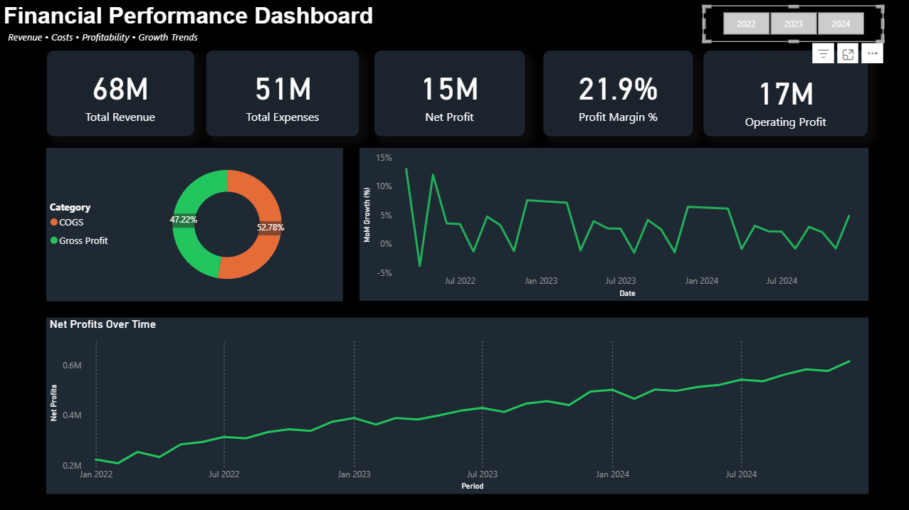

# Financial Performance Dashboard

## Project Highlights

* Built an interactive financial dashboard using Microsoft Power BI.
* Analyzed business performance through key financial KPIs and trend analysis.
* Transformed raw financial data into meaningful visual insights for decision-making.
* Created an executive-style dashboard for monitoring profitability and growth.

## Project Overview

This project focuses on analyzing financial performance through an interactive Power BI dashboard. The dashboard was designed to provide a clear overview of business performance by tracking revenue, profitability, and growth-related metrics.

## Objectives

* Monitor overall financial performance.
* Track key profitability indicators.
* Analyze business growth trends.
* Present financial data through intuitive visualizations.

## Tools Used

* Microsoft Power BI
* Microsoft Excel
* Data Cleaning & Validation
* Data Visualization

## Key Metrics Analyzed

* Revenue
* Gross Profit
* Net Profit
* Gross Profit Margin (%)
* Net Profit Margin (%)
* Month-over-Month Growth (%)

## Dashboard Features

### KPI Monitoring

Provides a quick overview of key financial performance indicators.

### Trend Analysis

Visualizes changes in revenue and profitability over time.

### Performance Evaluation

Highlights business performance through comparative financial metrics and visual reporting.

## Key Insights

* Revenue and profitability trends can be monitored through a centralized dashboard.
* KPI tracking enables quick assessment of business performance.
* Visual analysis improves understanding of financial patterns and growth trends.
* Interactive reporting supports data-driven decision-making.

## Project Files

- [Power BI Dashboard File](Financial_KPI_Dashboard.pbix)
- [Dashboard PDF](Dashboard.pdf)

## Dashboard Preview

## Skills Demonstrated

* Power BI Dashboard Development
* Financial Analysis
* KPI Reporting
* Data Visualization
* Business Intelligence
* Data Cleaning
* Analytical Thinking
